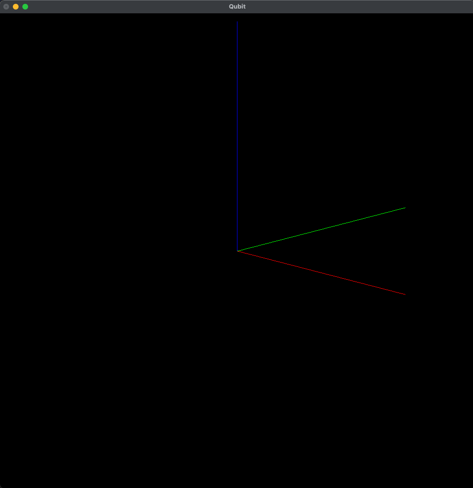
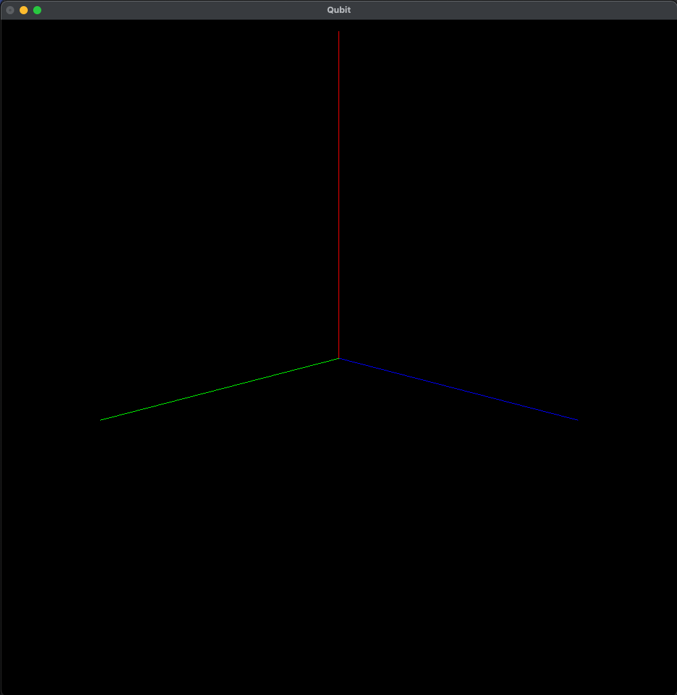

This project showcases how quaternions can be used to represent a reference frame in 3d space.
This reference frame can be rotated.
Quaternions can be multiplied with one another to retrieve a new axis of rotation.
This is demonstrated through the initialisation of the starting orientation of the frame.

Use arrow keys to move the reference frame by 90 degree intervals.
The rotation is animated through a technique called SLERP (Spherical Linear Interpolation).
Sources used inside of the source files!

Initial start position

Example of rotation in 90 degree intervals with arrow keys

